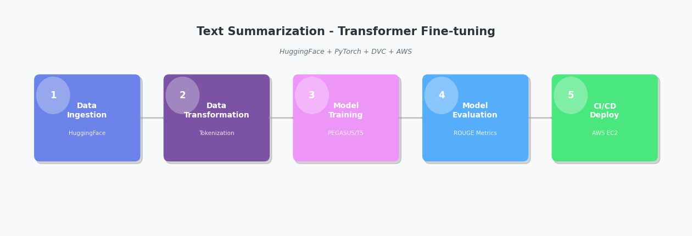

# Text-Summarization: A Production-Grade NLP Summarization System

An end-to-end, NLP-driven pipeline for automated text summarization engineered for modern content processing needs. By leveraging state-of-the-art Hugging Face Transformers, PyTorch acceleration, and modular MLOps practices, this system delivers accurate, concise summaries—ready for production deployment at scale.

---

## 📊 Project Workflow



*Complete end-to-end pipeline from data ingestion to deployment*

---

## 📂 Repository Structure
```
.
├── .github/
│   └── workflows/             # CI/CD pipeline workflows for automated deployment
├── config/
│   └── config.yaml            # Project configuration: artifact paths, model settings, data sources
├── less_records_artifacts/    # Sample artifacts from experiments with smaller dataset
├── notebook/                  # Jupyter notebooks for experimentation and prototyping
│   ├── data/                  # Sample data for notebook experiments
│   ├── EDA.ipynb              # Exploratory data analysis
│   ├── data_ingestion.ipynb   # Data ingestion prototyping
│   ├── data_transformation.ipynb # Data transformation experimentation
│   ├── model_trainer.ipynb    # Model training and fine-tuning experiments
│   ├── model_evaluation.ipynb # Model evaluation with ROUGE metrics
│   ├── model_prediction.ipynb # Prediction pipeline testing
│   └── trail.ipynb            # Experimental trials
├── text_summarization/        # Main package source code
│   ├── __init__.py
│   ├── cloud/
│   │   └── __init__.py        # Cloud storage operations (S3, model registry)
│   ├── components/            # Core pipeline components
│   │   ├── __init__.py
│   │   ├── data_ingestion.py        # Downloads and extracts dataset from HuggingFace
│   │   ├── data_transformation.py   # Tokenizes text and prepares data for model training
│   │   ├── model_trainer.py         # Fine-tunes transformer model (PEGASUS/T5) for summarization
│   │   └── model_evaluation.py      # Evaluates model using ROUGE scores
│   ├── configuration/
│   │   └── __init__.py        # Configuration manager: reads config.yaml, creates entity objects
│   ├── constants/
│   │   └── __init__.py        # Project constants: file paths, model names, environment variables
│   ├── entity/
│   │   └── __init__.py        # Dataclass entities: artifact and configuration objects
│   ├── exception/
│   │   └── __init__.py        # Custom exception handling with detailed error messages
│   ├── logger/
│   │   └── __init__.py        # Structured logging setup with timestamps
│   ├── pipeline/              # Orchestration layer for training and prediction pipelines
│   │   ├── __init__.py
│   │   ├── stage_01_data_ingestion.py      # Orchestrates data ingestion component
│   │   ├── stage_02_data_transformation.py # Orchestrates data transformation component
│   │   ├── stage_03_model_trainer.py       # Orchestrates model training component
│   │   ├── stage_04_model_evaluation.py    # Orchestrates model evaluation component
│   │   ├── prediction_pipeline/
│   │   │   └── __init__.py    # Prediction pipeline: loads model and generates summaries
│   │   └── training_pipeline/
│   │       └── __init__.py    # Training pipeline: executes all 4 stages sequentially
│   └── utils/
│       └── __init__.py        # Utility functions: YAML I/O, model loading, common operations
├── .dockerignore              # Excludes unnecessary files from Docker image build
├── .gitignore                 # Git exclusions: virtual environments, artifacts, model checkpoints
├── Dockerfile                 # Container image for production deployment
├── README.md                  # Project documentation and setup instructions
├── app.py                     # FastAPI application: /predict endpoint for text summarization
├── main.py                    # Training pipeline orchestrator: runs all 4 stages
├── params.json                # Hyperparameters for model training (learning rate, batch size, epochs)
├── paths.json                 # Important file paths configuration
├── requirements.txt           # Python dependencies: transformers, datasets, evaluate, FastAPI
└── setup.py                   # Package installer: configures package for pip installation
```

---

## 🔧 Core Workflow

1. **Data Ingestion**  
   Uses DVC to pull training datasets (news articles, documents) from remote storage, running `stage_01_data_ingestion.py` to persist cleaned and tokenized datasets.

2. **Data Preprocessing & Tokenization**  
   Tokenizes text using SentencePiece and Hugging Face tokenizers in `stage_02_data_preprocessing.py`, preparing input sequences for transformer models.

3. **Model Training & Fine-Tuning**  
   Fine-tunes pre-trained transformer models (T5, BART, or custom architectures) through `stage_03_model_trainer.py` using PyTorch with distributed training acceleration via `accelerate`.

4. **Evaluation & Metrics**  
   Evaluates model performance using ROUGE metrics (ROUGE-1, ROUGE-2, ROUGE-L) and Hugging Face `evaluate` library in `stage_04_model_evaluation.py`, generating comprehensive performance reports.

5. **Real-Time Inference API**  
   - **FastAPI Backend** (`app.py`): Exposes `/summarize` and `/train` REST endpoints with Uvicorn ASGI server for high-performance inference.
   - **Response Times**: Sub-second summarization for documents up to 10,000 words.
   - **Deployment**: Production-ready containerized service with health checks and logging.

---

## ✅ Key Capabilities

- **State-of-the-Art NLP Models**  
  Leverages Hugging Face Transformers (v4.49.0) with support for T5, BART, PEGASUS, and custom fine-tuned models for domain-specific summarization.

- **Modular, Scalable Architecture**  
  Decoupled data ingestion, preprocessing, training, and inference layers enable easy model swapping and horizontal scaling.

- **Production-Ready MLOps Stack**  
  - **DVC** for dataset and model versioning with S3 backend integration
  - **Configuration-driven development** using YAML for reproducible experiments
  - **Structured logging** for pipeline transparency and debugging
  - **Custom exception handling** for robust error management

- **Comprehensive Evaluation**  
  Built-in ROUGE score calculation (precision, recall, F1) with support for custom evaluation metrics and automated performance tracking.

- **Distributed Training Support**  
  Utilizes Hugging Face `accelerate` library for efficient multi-GPU training and mixed-precision optimization.

- **Extensible Architecture**  
  Easily swap transformer architectures, tokenizers, or add custom preprocessing steps with minimal code changes.

---

## 🚀 Deployment & CI/CD

- **GitHub Actions**  
  Automated linting, testing, Docker builds, and deployment pipelines triggered on every commit (`.github/workflows/`).

- **AWS EC2 Deployment**  
  - Deployed on AWS EC2 instances with auto-scaling capabilities
  - Docker containerization for consistent environments
  - AWS ECR for secure image storage and version management
  - Environment variable management via `.env` files

- **Self-Hosted GitHub Runners**  
  Configured Linux-based self-hosted runners for cost-effective CI/CD automation with background service management.

- **Environment-Driven Configuration**  
  Manage secrets and endpoints via `.env` file:
```
AWS_ACCESS_KEY_ID=your_access_key
AWS_SECRET_ACCESS_KEY=your_secret_key
AWS_REGION=your_region
AWS_ECR_LOGIN_URI=your_ecr_uri
ECR_REPOSITORY_NAME=your_repo_name
```

---

## 🏃 Running Locally

1. **Clone the repository**
```
git clone https://github.com/hasan-raza-01/Text-Summarization.git
cd Text-Summarization
```
2. **Set up environment variables**
```
cp .env.example .env
```
#### Edit .env with your AWS credentials and configuration
3. **Manual package build/run**
  - **Install package manager uv by astral**
    - Official documentation: https://docs.astral.sh/uv/getting-started/installation/

  - **create virtual environment with dependencies**
    ```bash
    uv sync
    ```
  - **activate the environment**
    - *windows*
      ```bash
      .venv\scripts\activate
      ```
    - *linux*
      ```bash
      source .venv/bin/activate
      ```
  - **Note: you can tweek params.json according to your choice**
  
  - **Start FastAPI application**
  ```
  uv run app.py
  ```
4. **(Alternative) Docker deployment**
```
docker build --no-cache -t text-summarization:latest .
docker run -p 8080:8080 --env-file .env text-summarization:latest
```
5. **Test the API**  
Navigate to http://127.0.0.1:8080/docs for interactive API documentation (Swagger UI).

---

## 🛠️ Technology Stack

- **NLP & Transformers**: Hugging Face Transformers (v4.49.0), PyTorch (v2.6.0)
- **Evaluation**: ROUGE metrics (rouge-score, rouge), Hugging Face Evaluate
- **MLOps**: DVC (v3.59.0), DVC-S3 integration
- **Backend**: FastAPI (v0.115.8), Uvicorn (v0.34.0)
- **Training Optimization**: Accelerate (v1.4.0), SentencePiece tokenization
- **Deployment**: Docker, AWS EC2, AWS ECR, GitHub Actions
- **Development**: Python-dotenv, Python-box, PyYAML, tqdm

---

## 📝 Workflow Configuration

The project follows a structured workflow pattern:

1. Update `config.yaml` with dataset paths and model parameters
2. Update `.env` (optional) with AWS credentials
3. Update constants in `src/text_summarization/constants.py`
4. Update entity definitions for data structures
5. Update configuration classes
6. Update component implementations (data ingestion, training, etc.)
7. Update pipeline orchestration
8. Update `main.py` for end-to-end execution
9. Update `dvc.yaml` for pipeline stage definitions

---

## Setup GitHub Secrets

1. AWS_ACCESS_KEY_ID
2. AWS_SECRET_ACCESS_KEY
3. AWS_REGION
4. AWS_ECR_LOGIN_URI
5. ECR_REPOSITORY_NAME

---

## Docker Setup In EC2 Commands to be Executed

### Optional
```
sudo apt-get update -y
sudo apt-get upgrade -y
```
### Required
```
curl -fsSL https://get.docker.com -o get-docker.sh
sudo sh get-docker.sh
sudo usermod -aG docker ubuntu
newgrp docker
```

---

## Add Environment Variables to EC2 Instance

### Create/edit the .env file:
```
nano /home/ubuntu/.env
```
#### Paste all variables and press CTRL+X, Y, ENTER

---

## Reconnect with GitHub Runner
```
cd actions-runner && ./run.sh
```
